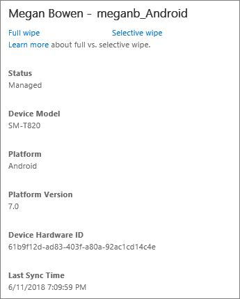

# Wipe a mobile device in Office 365
  
You can use built-in mobile device management for Office 365 to do a selective wipe to remove only organizational information, or a full wipe to delete all information from a mobile device and restore it to its factory settings.
  
## What to know before you begin

- Mobile devices can store sensitive organizational information and provide access to your organization's Office 365 resources. To help protect your organization's information, you can do a full wipe or a selective wipe:
    
  - **Full wipe**: Deletes all data on a user's mobile device, including installed applications, photos, and personal information. When the wipe is complete, the device is restored to its factory settings. 
    
  - **Selective wipe**: Removes only organization data and leaves installed applications, photos, and personal information on a user's mobile device. 
    
- When a device is wiped (full wipe or selective wipe), the device is removed from the list of managed devices.
    
- You can set up a mobile device management policy that automatically wipes (full wipe) a device after the user unsuccessfully tries to enter the device's password a specific number of times. Follow the steps in [Create and deploy device security policies](create-device-security-policies.md).
    
- If you want to know what a user will experience when you wipe their device, see [What's the user and device impact?](wipe-a-mobile-device.md#BKMK_Impact).
    
## Wipe a mobile device

1. Go to the .

2. Go to [Go to the Office 365 Security &amp; Compliance Center](https://support.office.com/article/7e696a40-b86b-4a20-afcc-559218b7b1b8)\> **Data loss prevention** \> **Device management**.
    
3. Select the device you want to wipe.
    
4. Select the type of remote wipe you want to do.
    
  - To do a selective wipe and delete only Office 365 organization information, in the right pane, select **Selective wipe**.
    
  - To do a full wipe and restore the device to its factory settings, in the right pane, select **Full wipe**.
    

  
5. Select **Yes** to confirm. 
    
Until the wipe finishes, the **Device status** will show as **RetirePending** or **RetireIssued**.
  
### How do I know it worked?

You'll no longer see the mobile device in the list of managed devices.
  
## Why would you want to wipe a device?

There are several reasons for wiping devices:
  
- Mobile devices like smartphones and tablets are becoming more full-featured all the time. This means it's easier for your users to store sensitive corporate information (such as personal identification or confidential communications) and access it on the go. If one of these mobile devices is lost or stolen, wiping the device immediately can help prevent your organization's information from ending up in the wrong hands.
    
- When a user leaves the organization with a personal device that is enrolled in MDM for Office 365, you can help prevent organizational information from going with that user by doing a selective wipe.
    
- If your organization provides mobile devices to users, you might need to reassign devices from time to time. Doing a full wipe on a device before assigning it to a new user helps ensures that any sensitive information from the previous owner is deleted.
    
## What's the user and device impact?

The wipe is sent immediately to the mobile device. The device is also marked as not compliant in AAD.
  
The following table describes what content is removed for each device type when a device is selectively wiped.
  
|**Content impact**|**Windows Phone 8.1**|**iOS 7.1+**|**Android 4+**|
|:-----|:-----|:-----|:-----|
|Company Portal app\* is uninstalled.    |N/A    |✔    |N/A    |
|Office 365 app data hosted by apps where access control is supported by MDM for Office 365 is removed (currently Outlook and OneDrive for Business). The apps are not removed.    Outlook for Android does not remove cached emails.    |✔    |✔    |✔    |
|Policy settings that were applied by MDM for Office 365 to devices are no longer enforced on the device and users can change the settings.    |✔    |✔    |✔    |
|Email profiles created by MDM for Office 365 are removed and cached email on the device is deleted.    |N/A    |✔    |N/A    |
   
> [!NOTE]
> \* Company Portal app is available at the App Store for iOS and the Play Store for Android devices. 
  
## Related content

[Manage mobile devices in Office 365](set-up-mobile-device-management.md)
  

