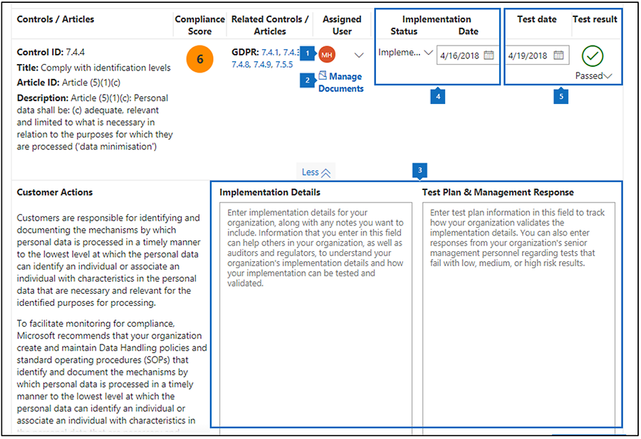
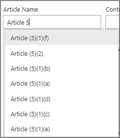
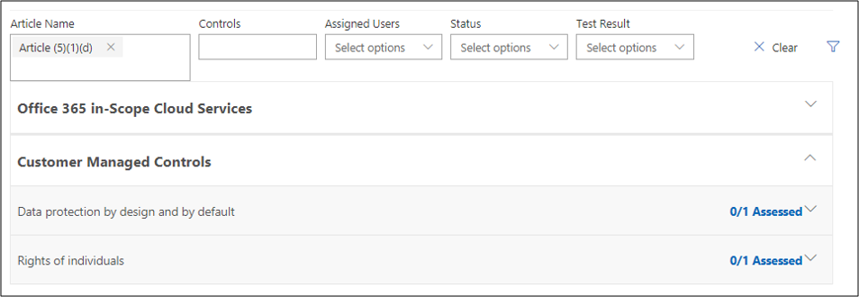
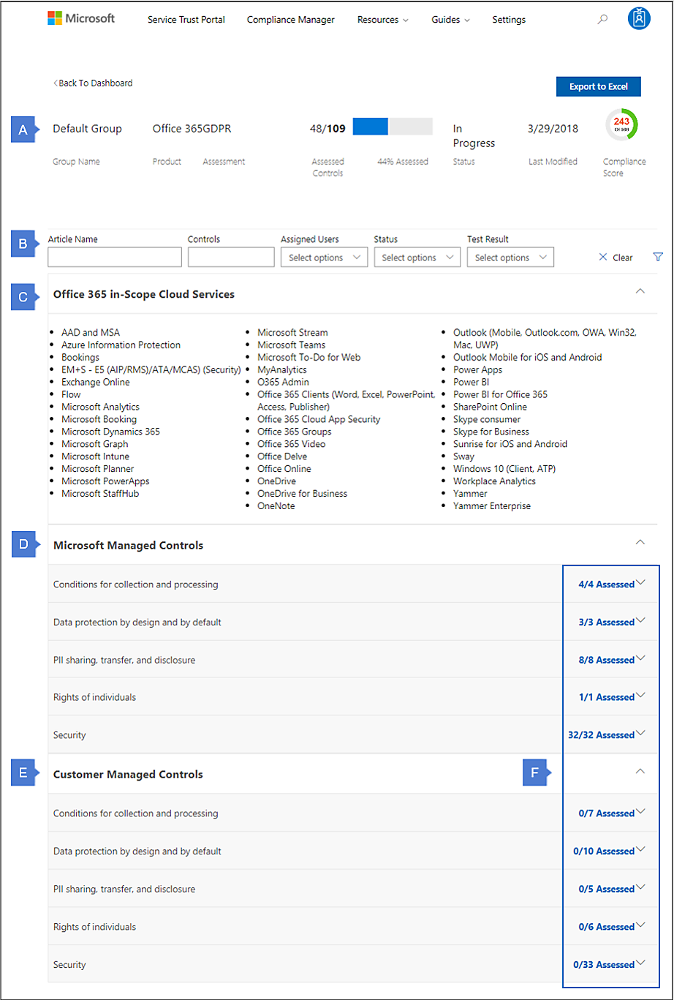
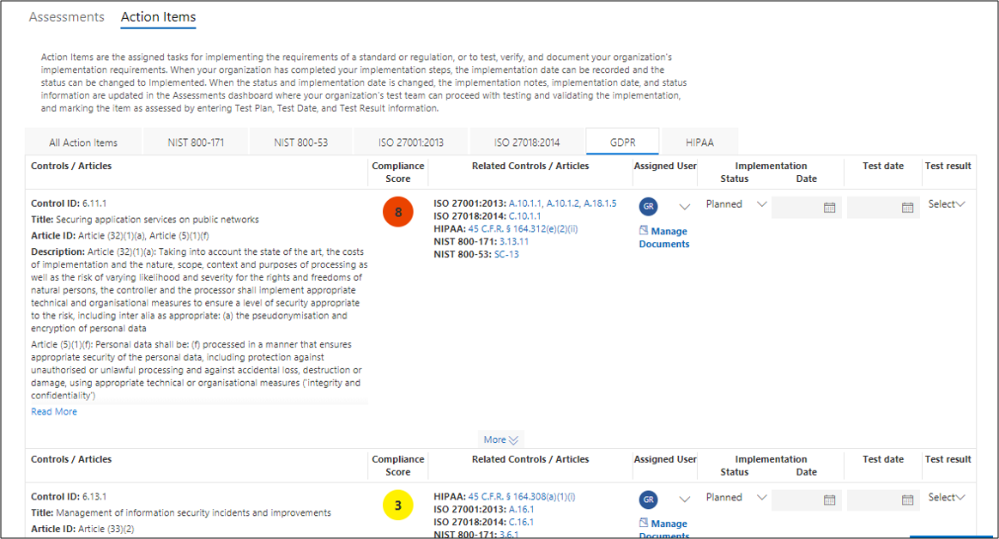
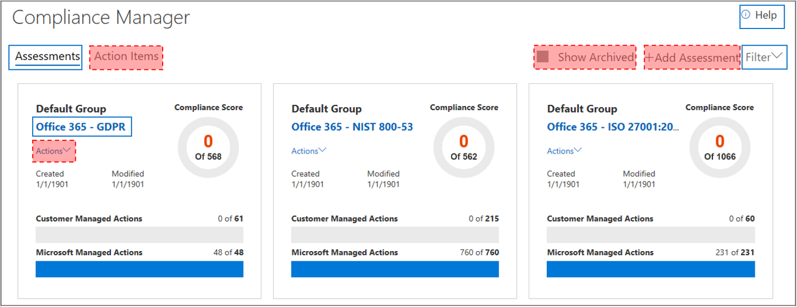
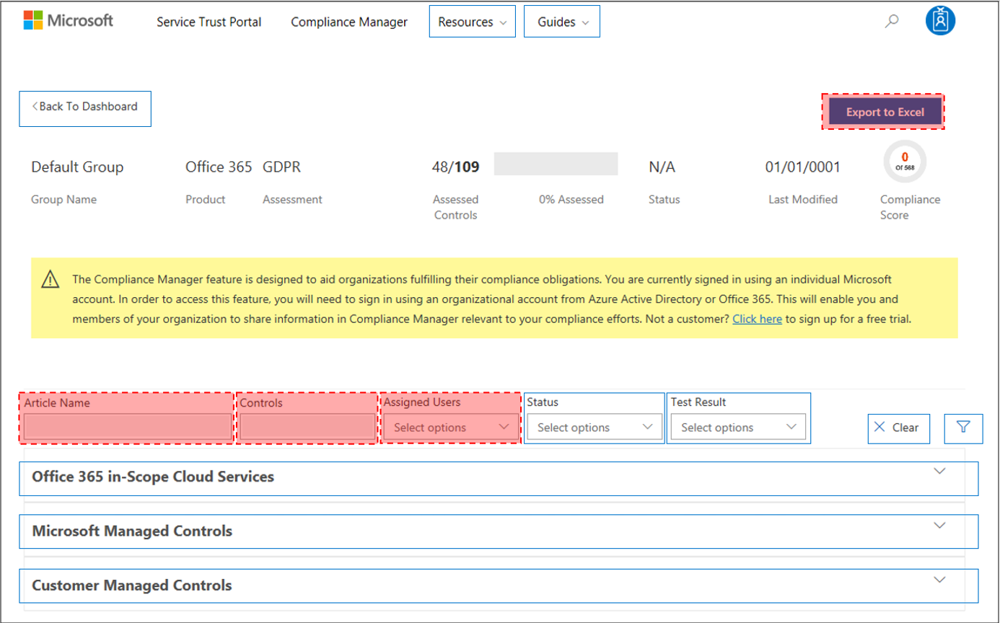

# Working with Microsoft Compliance Manager

> [!IMPORTANT]
> Microsoft Compliance Manager is a dashboard and management tool that provides a summary of your data protection and compliance stature and recommendations to improve data protection and compliance. The customer actions provided in Compliance Manager are recommendations; it is up to your organization to evaluate the effectiveness of these recommendations in their respective regulatory environment prior to implementation. Recommendations found in Compliance Manager should not be interpreted as a guarantee of compliance.

## Groups

Groups are containers that allow you to logically organize Assessments and that share common information and workflow tasks between Assessments that have the same or related customer managed controls. You can group Assessments by year, standard, service, team, division, or agencies within your organization to help minimize customer-managed Actions:
  
- **GDPR Assessments - 2019**
  - Office 365 + GDPR
  - Dynamics + GDPR
- **Data Security and Privacy Assessments**
  - Office 365 + ISO 27001:2018
  - Office 365 + ISO 27018:2019
  - Azure + ISO 27001:2018
  - Azure + ISO 27018:2019

When you create a new Assessment, you must create a new group for the Assessment or assign the Assessment to an existing group. Groups can not be created as stand-alone entities. It's recommended that you determine a grouping strategy for your organization *before* adding new assessments. By default, a Group named "Default Group" is available for your initial Assessments. Groups do not have any security properties, all permissions are associated with Assessments.

When working with groups, remember:
  
- Related assessment controls in different assessments within the same Group automatically update when completed.
- New groups have the option to copy information from an existing group when you create a new Assessment. Any information that was added to the Implementation Details and Test Plan and Management Response fields of customer-managed controls from Assessments in the group that you're copying from are copied to the same (or related) customer managed controls in the new Assessment. If you're adding a new Assessment to an existing group, common information from Assessments in that group will be copied to the new Assessment.
- Group names (also called *Group IDs*) must be unique within your organization.
- Groups can contain Assessments for the same certification/regulation, but each group can only contain one Assessment for a specific cloud service/certification pair. For example, a group can't contain two Assessments for Office 365 and GDPR. A group can contain multiple Assessments for the same cloud service as long as the corresponding certification/regulation for each one is different.
- Once an assessment has been added to an assessment group, the grouping cannot be changed. You can rename the assessment group, which changes the name of the assessment grouping for all of the assessments associated with that group. You can create a new assessment and a new assessment group and copy information from an existing assessment, which effectively creates a duplicate of that assessment in a different assessment group. 
- Archiving an assessment breaks the relationship between that assessment and the assessment group; any further updates to other related assessments are no longer reflected in the archived assessment.

## Assessments

### Managing the assessment process

The creator of an Assessment is initially the only Assessment User. For each customer managed control, you can assign an Action Item to a person in your organization so that person becomes an Assessment User who can perform the recommended customer actions and gather and upload evidence. When you assign an Action Item, you can choose to send an email to the person that contains details including the recommended Customer Actions and the Action Item priority. The email notification includes a link to the **Action Items** dashboard, which lists all Action Items assigned to that person. 
  
Here's a list of tasks that you can perform using the workflow features of Compliance Manager.
  

  
1. **Use the Filter Options to find specific assessment controls** - Compliance Manager provides **Filter Options**, giving you highly granular selection criteria for displaying assessment controls, helping you to precisely target specific areas of your compliance efforts. 
    
    Click on the funnel icon on the right hand side of the page to show or hide the **Filter Options** controls. These controls allow you to specify filter criteria, and only the assessment controls that fit those criteria will be displayed below. 
  
    - **Articles** - filters on the article name and returns the assessment controls associated to that article. For instance, typing in "Article (5)" returns a selection list of articles whose name includes that string, i.e. Article (5)(1)(a), Article (5)(1)(b), Article (5)(1)(c), etc. Selecting Article (5)(1)(c) will return the controls associated with Article (5)(1)(c). This is multiselect field that uses an OR operator with multiple values -- for instance, if you select Article (5)(1)(a) and then add Article (5)(1)(c), the filter will return controls associated with either Article (5)(1)(a) or Article (5)(1)(c). 
    
      
  
    - **Controls** - returns the list of controls whose names fit the filter, i.e. typing in 7.3 returns a selection list of items like 7.3.1, 7.3.4, 7.3.5, etc. This is multiselect field that uses an OR operator with multiple values -- for instance, if you select 7.3.1 and then add 7.3.4, the filter will return controls associated with either 7.3.1 or 7.3.4. 
    
      
  
    - **Assigned Users** - returns the list of controls who are assigned to the selected user. 
    
    - **Status** - returns the list of controls with the selected status. 
    
    - **Test Result** - returns the list of controls with the selected test result. 
    
    As you apply filter conditions, the view of applicable controls will change to correspond to your filter conditions. Expand the control family sections to show the control details below. 
    
    
  
2. If after selecting the desired filters no results are shown, that means there are no controls that correspond to the specified filter conditions. For instance, if you select a particular **Assigned User** and then choose a **Control** name that does correspond to the control assigned to that user, no assessments will be shown in the page below. 
    
3. **Assign an Action Item to a user** - You can assign an Action Item to a person to implement the requirements of a certification/regulation, or to test, verify, and document your organization's implementation requirements. When you assign an Action Item, you can choose to send an email to the person that contains details including the recommended Customer Actions and the Action Item priority. You can also unassign or reassign an Action Item to a different person. 
    
4. **Manage documents** - Customer managed controls also have a place to manage documents that are related to performing implementation tasks and for performing testing and validation tasks. Anyone with permissions to edit data in Compliance Manager can upload documents by clicking **Manage Documents**. After a documented has been uploaded, you can click **Manage Documents** to view and download files. 
    
5. **Provide implementation and testing details** - Every customer managed control has an editable field where users can add implementation details that document the steps taken by your organization to meet the requirements of the certification/regulation, and to validate and document how your organization meets those requirements.
    
6. **Set Status** - Set the Status for each item as part of the assessment process. Available status values are **Implemented**, **Alternative Implementation**, **Planned**, and **Not in Scope**. 
    
7. **Enter test date and test result** - The person with the Compliance Manager Assessor role can verify that proper testing performed, review the implementation details, test plan, test results, and any uploaded evidence, and then set the Test Date and Test Result. Available test result values are **Passed**, **Failed-Low Risk**, **Failed-Medium Ris** **k**, and **Failed-High Risk**. 

### Add an Assessment

To add an Assessment to Compliance Manager:
  
1. In the Compliance Manager dashboard, select **Add Assessment**.
    
2. In the **Add an Assessment** window, complete the following information

    - **Title (required):** Enter a title for your Assessment
    - **Select a template (required):** Select a standard or custom template
    - **Select a group or add a new group (required):** Select an existing group or create and add the Assessment to a new group
    - **Copy data from an existing group (optional):** Toggle the control to enable group copy
    - **Select a group (optional):** If group copy is enabled, select the group to copy from
    - **Implementation Details (optional):** Select to copy implementation details to the new group
    - **Test plan & additional information (optional):** Select to copy test plan and additional information details to the new group
    - **Documents (optional):** Select to copy documents to the new group

3. Select **Save** to create the Assessment.

 The new Assessment is automatically added as an Assessment tile on the Compliance Manager dashboard. This tile displays:

- The title of the Assessment.
- The dimensions of the Assessment, including certification, environment, and product applied to the Assessment.
- The date it was created and date when it was last modified.
- The Assessment Score (the sum of all of the assigned control risk values that have been implemented, tested and passed).
- Progress indicators along the bottom that show the number of Microsoft-managed and customer-manged controls that have been assessed.

### Copying information from existing Assessments

When you create a new Assessment, you have the option to copy information from Assessments in an existing group to the new Assessment. This allows you to apply the completed assessment and testing work to the same customer managed controls in the new Assessment. For example, if you have a group for all GDPR-related Assessments in your organization, you can copy common information from existing assessment work when adding a new Assessment to the group.
  
You can copy the following information from customer to a new Assessment:
  
- Assessment Users. An Assessment user is a user who the control is assigned to.
- Status, Test Date, and Test Results.
- Implementation details and test plan information.

Similarly, information from shared customer managed controls within the same Assessment group is synchronized. And information in related customer managed controls within the same Assessment is also synchronized.

To copy information from an existing Assessment to a new Assessment:
  
1. In the Compliance Manager dashboard, select **Add Assessment**.
    
2. In the **Add an Assessment** window, complete the following information

    - **Title (required):** Enter a title for your Assessment
    - **Select a template (required):** Select a standard or custom template
    - **Select a group or add a new group (required):** Select an existing group or create and add the Assessment to a new group
    - **Copy data from an existing group (required for copying Assessment data):** Toggle the control to enable group copy
    - **Select a group (required for copying Assessment data):** If group copy is enabled, select the group to copy from
    - **Implementation Details (select as needed):** Select to copy implementation details to the new group
    - **Test plan & additional information (select as needed):** Select to copy test plan and additional information details to the new group
    - **Documents (select as needed):** Select to copy documents to the new group

3. Select **Save** to create the Assessment.

### Viewing Assessments

Assessment information is viewed....

To view Assessment details:
  
1. In the Compliance Manager dashboard, navigate to the Assessment Tile corresponding to the assessment you wish to view, Select the assessment name to open it and view the Action Items and the Microsoft and customer-managed controls associated with the Assessment.

Here's an example of the Assessment for Office 365 and GDPR.

  
1. This section shows the Assessment summary information, including the name of the Assessment Grouping, Product, Assessment name, number of Assess controls
    
2. This section shows the Assessment Filter controls. For a more detailed explanation of how to use the Assessment Filter controls see the [Managing the assessment process](#managing-the-assessment-process) section. 
    
3. This section shows the individual cloud services that are in-scope for the assessment.
    
4. This section contains Microsoft managed controls. Related controls are organized by control family. Click a control family to expand it and display individual controls.
    
5. This section contains customer managed controls, which are also organized by control family. Click a control family to expand it and display individual controls.
    
6. Displays the total number of controls in the control family, and how many of those controls have been assessed. A key capability of Compliance Manager is tracking your organization's progress on assessing the customer managed controls. For more information, see the [Understanding the Compliance Score](#understanding-the-compliance-score) section. 

### Export an Assessment

You can export an Assessment to an Excel file for compliance stakeholders in your organization or for external auditors and regulators. The report is a snapshot of the Assessment as of the date and time that the report is created. The report contains the details for all Microsoft and customer-managed controls for the Assessment, control implementation status, control test date, test results, and provides links to uploaded evidence documents. You should export the Assessment report prior to archiving an assessment because archived assessments do not retain links to uploaded documents.
  
To export an Assessment report:
  
1. On the Compliance Manager dashboard, select **Controls Info** tab.
2. Select the **Group** and **Assessment** in the drop down menus for the Assessment you want to export.
3. Select the **Export** button.

The assessment report is downloaded as an Excel file in your browser session. The files name for the Excel file defaults to the title of the Assessment.

### Archive an Assessment

When you have completed an Assessment and no longer need it for compliance purposes, you can archive it. When an Assessment is archived, it is removed from the default Assessments view on the Compliance Manager dashboard.
  
> [!IMPORTANT]
> Archived Assessments do not retain their links to uploaded evidence documents. It is highly recommended that you export the Assessment before archiving to retain links to the evidence documents in the report. 
  
To archive an Assessment:

1. On the Compliance Manager dashboard, navigate to the dashboard tile for the Assessment you want to archive

2. Select the **Archive Assessments** control or **Archive** from the actions control.

3. The **Archive Assessments** dialog is displayed, asking you to confirm that you want to archive the assessment.

4. To continue with archiving, select **Archive**. To cancel archiving the Assessment, select **Cancel**.

### View archived Assessments
  
1. On the Compliance Manager dashboard, select the **Assessments** tab and select the **Show Archived** checkbox.

2. The archived assessments will appear a new **Archived Assessments** section below the active assessments.

3. Select the name of the assessment you wish to view.

Archived Assessment information includes in-scope services, Microsoft and customer-managed control details. When viewing an archived assessment, none of the normally editable controls (i.e. Implementation, Test Results) will be active and the **Managed Documents** button will be absent.

### Activate an archived Assessment

1. On the Compliance Manager dashboard, select the **Assessments** tab and select the **Show Archived** checkbox.

2. The archived assessments will appear a new **Archived Assessments** section below the active assessments.

3. Select the **Activate archived Assessment** control of the assessment you wish to activate.

4. The **Active Archived Assessments** dialog is displayed, asking you to confirm that you want to activate the assessment.

5. To continue with activation, select **Activate**. To cancel activation of the Assessment, select **Cancel**.

The Assessment is now activated and the tile for the Assessment appears in the dashboard.

## Controls

## Actions

Actions are the assigned tasks for implementing the requirements of a standard or regulation, or to test, verify, and document your organization's implementation requirements. When your organization has completed your implementation steps, the implementation date can be recorded and the status can be changed to Implemented. When the status and implementation date is changed, the implementation notes, implementation date, and status information are updated in the Assessments dashboard where your organization's test team can proceed with testing and validating the implementation, and marking the item as assessed by entering Test Plan, Test Date, and Test Result information.

### Assigning action items
  
1. On the Compliance Manager dashboard, locate the assessment tile of the assessment you wish to work with and click on the name of the assessment to go to the assessment details page.
    
2. You can click **Filter** and use the filter controls to find the specific assessment control you wish to assign, or 
    
3. Scroll down to the Customer Managed Controls section, expand the control family, and scroll through the list of control until you have located the assessment control to be assigned
    
4. Under the **Assigned User** column, click **Assign**. 
    
5. In the Assign Action Item dialog box, click the **Assign To** field to populate the list of users to whom the action can be assigned. You can scroll through the list to find the target user or start typing in the field to search for the username. 
    
6. Click the user to assign them this action item.
    
7. If you wish to send an email notification to the user notifying them, ensure that the **Send Email Notification** checkbox is checked. 
    
8. Type any notes you wish to be displayed to that user and click **Assign**. 
 
    The user will receive notification of their action item assignment and any notes you have provided.
    
The notes that are associated with the action item are persisted in the notes section, available for the next time the action item is assigned. These notes are not read-only, can be edited, replaced or removed by the person assigning the action item.

### Viewing action items

Compliance Manager provides a convenient view of all your assigned control assessment action items, enabling you to quickly and easily take action on them. You can view all action items or select the action items that correspond with a specific certification by clicking on the tab associated with that assessment. For instance, in the image below, the GDPR tab has been selected, showing controls that related to the GDPR assessment.
  

  
To view your action items:
  
1. Go to the Compliance Manager dashboard
    
2. Click the **Action Items** link, and the page will refresh to show the action items that have been assigned to you. 
    
    By default, all action items are shown. If you have action items across multiple certifications, the names of the certifications will be listed in tabs across the top of the assessment control. To see the action items for a specific certification, click that tab.

## Documents

## Templates

## Archiving

## Reporting

## Permissions

The following table describes each Compliance Manager permission and what it allows the user do. The table also indicates the role that each permission is assigned to.

ADD ACCESS TO RESTRICTED DOCUMENTS ROLE?? - SCOTT WILL CONFIRM
 
||**Compliance Manager Reader**|**Compliance Manager Contributor**|**Compliance Manager Assessor**|**Compliance Manager Administrator**|**Portal Admin**|
|:-----|:-----|:-----|:-----|:-----|:-----|
|**Read data** - Users can read but not edit data.    |             |             |             |             |             |
|**Edit data** - Users can edit all fields, except the Test Result and Test Date fields.    ||             |             |             |             |
|**Edit test results** - Users can edit the Test Result and Test Date fields.    |||             |             |             |
|**Manage assessments** - Users can create, archive, and delete Assessments.    ||||             |             |
|**Manage users** - Users can add other users in their organization to the Reader, Contributor, Assessor, and Administrator roles. Only those users with the Global Administrator role in your organization can add or remove users from the Portal Admin role.    |||||             |
   
### Guest access
  
After Compliance Manager access has been configured, any user that does not have a provisioned role is in the **Guest access** role by default (which is also the experience of any non-organization-provisioned accounts like personal Microsoft Accounts). Guest Access users do not have full access to all of the Compliance Manager features and are not able to see any of the organization's compliance assessment data, however they are able to use Compliance Manager to view Microsoft's compliance assessment reports and Service Trust documents. For an illustration of what is and is not accessible, see the images below where accessible features are outlined in blue and inaccessible features are outlined in red. 
  

  
