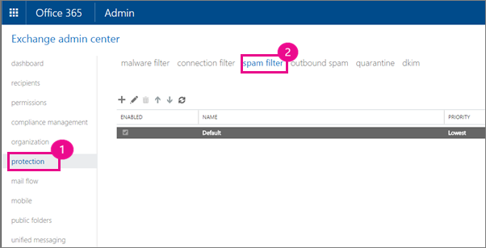
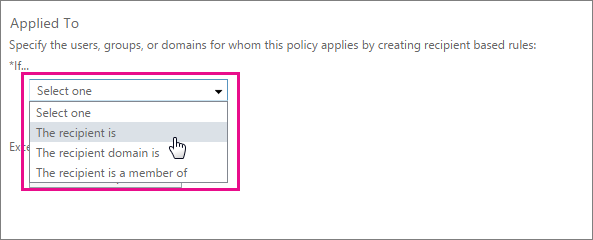

# Zero-hour auto purge - protection against spam and malware

## Overview

Zero-hour auto purge (ZAP) is an email protection feature that detects messages with spam or malware that have already been delivered to your users' inboxes, and then renders the malicious content harmless. How ZAP does this depends on the type of malicious content detected.
  
ZAP is available with the default Exchange Online Protection that is included with any Office 365 subscription that contains Exchange Online mailboxes.

ZAP is turned on by default, but the folowing conditions must be met:
  
- **Spam action** is set to **Move message to Junk Email folder**. <br/>You can also create a new spam filter policy that applies only to a set of users if you don't want all mailboxes to be screened by ZAP.

- Users have kept their default junk mail settings, and have not turned off junk email protection. (See [Change the level of protection in the Junk Email Filter](https://support.office.com/article/change-the-level-of-protection-in-the-junk-email-filter-e89c12d8-9d61-4320-8c57-d982c8d52f6b) for details about user options in Outlook.) 
  
## How does ZAP work?

Office 365 updates anti-spam engine and malware signatures in real-time on a daily basis. However, your users might still get malicious messages delivered to their inboxes for a variety of reasons, including if content is weaponized after being delivered to users. ZAP addresses this by continually monitoring updates to the Office 365 spam and malware signatures. ZAP can find and remove previously delivered messages that are already in users' inboxes. 
- For mail that is identified as spam, ZAP moves unread messages to users' Junk mail folder. 
- For newly detected malware, ZAP removes attachments from email messages, regardless of whether the email has been read. 
  
The ZAP action is seamless for the mailbox user; they are not notified if an email message is moved.
  
Allow lists, [mail flow rules](https://go.microsoft.com/fwlink/p/?LinkId=722755), and end user rules or additional filters take precedence over ZAP.
  
## To review or set up a spam filter policy
  
1. Go to [https://protection.office.com](https://protection.office.com) and sign in using your work or school account for Office 365.
2. Under **Threat management**, choose **Anti-spam**.
3. Review the standard settings. 
4. If you want to customize your settings, select the **Custom** tab, and turn on **Custom settings**. Edit your settings and if you want, choose **+ Create a policy** to add a new policy. 
    
## To see if ZAP moved your message

<<<<<<< HEAD
If you want to see if ZAP moved your message, you can use either the [Threat Protection Status report](view-email-security-reports.md#threat-protection-status-report-new) (or [Threat Explorer](use-explorer-in-security-and-compliance.md)).
=======
ZAP is turned on by default, but you do have to make sure a couple of conditions are met:
  
- Spam filter policy is set to [Move message to Junk Email folder](zero-hour-auto-purge.md#BK_SetSpam).
    
    You can also create a new spam filter policy that applies only to a set of users if you don't want all mailboxes to be screened by ZAP.
    
- The user's [Options \> Junk Email](https://support.office.com/article/068FA430-F8D7-4518-A8DA-8BC74958F05F).
    
If you want [to see if ZAP moved your message](zero-hour-auto-purge.md#BK_DidZAPMove), you can use the Exchange Online message trace tool.
  
Admins can also [disable ZAP](zero-hour-auto-purge.md#BK_Posh) by using PowerShell. 
  
 **To set spam filter policy**
  
1. Sign in to the [Where to sign in to Office 365 for business](https://support.office.com/article/e9eb7d51-5430-4929-91ab-6157c5a050b4) and choose **protection** \> **spam filter**. 
    
    
  
2. Either choose the filter policy you want to adjust, or choose **add** to create a new one. 
    
    In the previous screen shot, the policy is named "Default", but if you create additional spam filter policies you can give them a different name. You can also apply the policy to only a limited set of users.
    
3. In the policy window, choose **spam and bulk actions**, and make sure that **Spam** is set to **Move message to Junk Email folder**. 
    
    If you choose **Save** at this point, the policy applies to your Office 365 tenant. 
    
    
  
4. If you created a new policy, and you want to apply the policy to only a set of users, scroll to the **Applied To** section in the policy filter window, and in the menu controls choose the **recipients**, **domain**, or **group memberships** you want to apply the policy to. You can also set additional conditions and exceptions. 
    
    
  
    Choose **Save** to apply the policy to the selected users. 
    
 **To see if ZAP moved your message**
  
- You can use the [Find and fix email delivery issues as an Office 365 for business admin](https://support.office.com/article/e7758b99-1896-41db-bf39-51e2dba21de6) to determine if the message was moved by ZAP: 
    
    Look for the text "Zero-Hour Auto Purge (ZAP)" in your trace details to identify a message that was moved by ZAP.
>>>>>>> master
    
## To disable ZAP
  
If you want to disable ZAP for your Office 365 tenant, or a set of users, use the **ZapEnabled** parameter of [Set-HostedContentFilterPolicy](https://go.microsoft.com/fwlink/p/?LinkId=722758), an EOP cmdlet.
    
In the following example, ZAP is disabled for a content filter policy named "Test".
    
```
  Set-HostedContentFilterPolicy -Identity Test -ZapEnabled $false
```

## FAQ

### What happens if a legitimate message is moved to the junk mail folder?
  
You should follow the normal reporting process for false-positives. The only reason the message would be moved from the inbox to the junk mail folder would be because the service has determined that the message was spam or malicious.
  
### What if I use the Office 365 quarantine instead of the junk mail folder?
  
ZAP doesn't move messages into quarantine from the Inbox at this time.
  
### What If I have a custom mail flow rule (Block/ Allow Rule)?
  
Rules created by admins (mail flow rules) or Block and Allow rules take precedence. Such messages are excluded from the feature criteria.
  
## Related Topics

[Office 365 Email Anti-Spam Protection](anti-spam-protection.md)
  
[Block email spam with the Office 365 spam filter to prevent false negative issues](block-email-spam-to-prevent-false-negatives.md)
  

